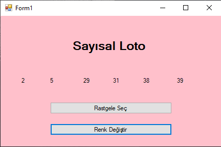
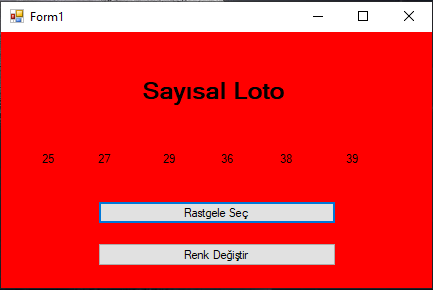
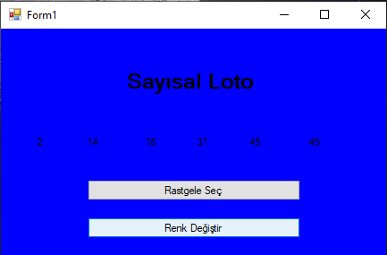

# 🎲 Sayısal Loto Oyunu

Bu proje, üniversite dönem içi uygulaması kapsamında geliştirilmiş basit bir sayısal loto simülasyonudur.  
Tamamen eğitim amaçlıdır ve gerçek loto sistemleriyle bağlantısı yoktur.

---

## 🧾 Proje Hakkında

Oyunda kullanıcı “Sayı Seç” butonuna tıkladığında rastgele sayılar üretilir.  
Ayrıca, “Renk Değiştir” butonuna basıldığında arka plan rengi rastgele değiştirilir.  
Kullanıcı sayı seçmez; amaç rastgele sayı üretimi ve arka plan renk değişimini deneyimlemektir.

---

## ⚙️ Kullanılan Teknolojiler

- C#  
- Windows Forms  
- .NET Framework / .NET  

---

## ✨ Uygulama Özellikleri

- “Sayı Seç” butonuyla rastgele sayılar üretme  
- “Renk Değiştir” butonuyla arka plan rengini değiştirme  
- Basit ve renkli grafiksel arayüz  

---

---

## 🖼️ Ekran Görüntüleri

### 🏠 Örnek Oyun 1 


### 📊 Örnek Oyun 2


### 📊 Örnek Oyun 3



---

## 📁 Kurulum

Projeyi kendi bilgisayarınızda çalıştırmak için:

```bash
git clone https://github.com/ahmetkavl/SayisalLoto.git
